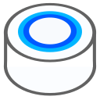
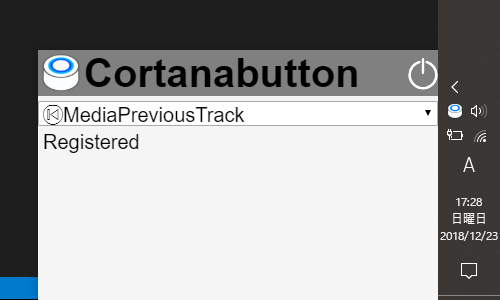

# cortanabutton
Media KeyにCortanaの聞き取り開始を割り当てる常駐アプリ。

BluetoothヘッドセットをWindows10にて"再生:既定のデバイス"としながら、Cortanaの音声入力デバイスとしても使用する場合、「コルタナさん」呼びかけによるCortanaの聞き取り開始ができない。そこで、Bluetoothヘッドセットのメディア操作ボタン(Media Key)にショートカットとしてCortanaの聞き取り開始を割り当てることで代用する。

* 割り当てたMedia Keyは、他のソフトで使うことができない。
* メディア再生ソフトが既に起動している場合など、すでにそのMedia Keyが使用されている時は割り当てに失敗する。メディア再生ソフトを終了してからリトライすればよい。
* Grooveミュージックと同時使用できない。GrooveミュージックはAVRCPのイベントを直接受け取る(？)ため、キーボード入力のイベントが発生しなくなる。

## Installation
下記より最新版のzipファイルをダウンロードし、好きな位置に展開してください。

https://github.com/CannoHarito/cortanabutton/releases


## Usage
* cortanabutton.exeを起動すると、タスクトレイにアイコンが表示され、初回起動時は設定ウィンドウが出る。
* タスクトレイのアイコンをクリックすると設定ウィンドウが出る。
* 設定ウィンドウのselect要素で指定したMedia KeyにCortana聞き取り開始が割り当てられる。
* 設定ウィンドウのフォーカスが外れると設定ウィンドウは非表示になる。
* 設定ウィンドウの電源アイコンを押すとアプリの常駐を終了する。




## Release

```sh
yarn install
yarn run build
```

The build will be in `build/` dir.

## Licence
This software is released under the MIT License, see LICENSE.

## Authors
Font generated by <a href="https://www.flaticon.com">flaticon.com</a>. <p>Under <a href="http://creativecommons.org/licenses/by/3.0/">CC</a>: <a data-file="005-power" href="https://www.flaticon.com/authors/smashicons">Smashicons</a></p>  
     